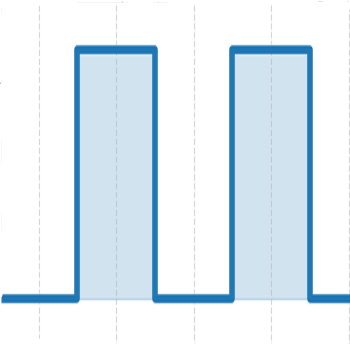
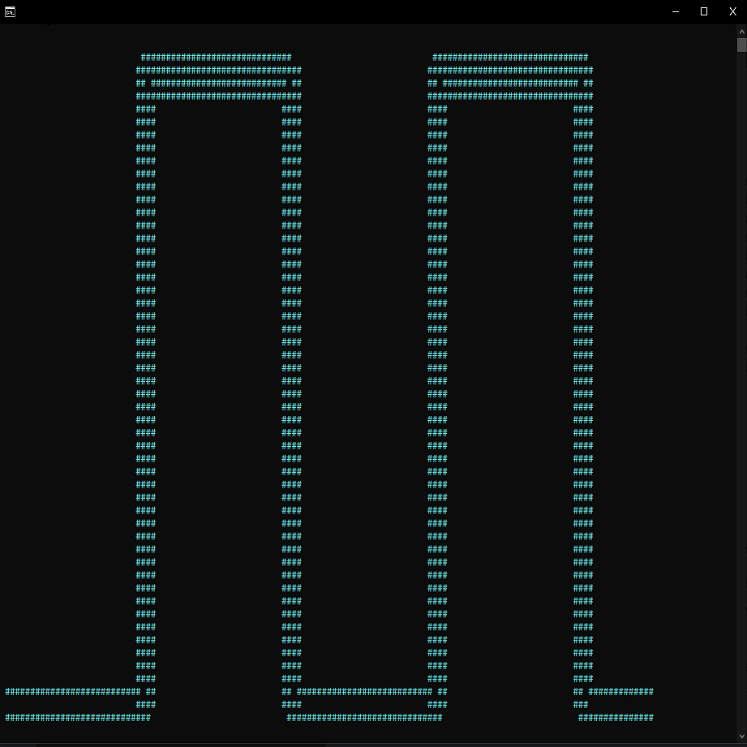

<div align="center">
  
  
  <h1>The Pulse Programming Language</h1>
  <p><i>A lightweight, block-scoped scripting language designed for ultra-fast GUI prototyping and native Python interoperability.</i></p>
</div>

---

## ⚡ What is Pulse?

**Pulse** (`.pulse`) is a completely new programming language built around a Python interpreter. It abstracts away complex UI frameworks and heavy boilerplate, letting you build functional desktop applications in seconds. 

### Why Use Pulse?
- **Declarative GUI Engine:** Build windows, buttons, text inputs, and images naturally with nested blocks. No complex state management required—just `update(var)` to instantly refresh the screen.
- **Native Python Interop:** Call *any* Python standard library or third-party package (`requests`, `pyautogui`, `numpy`) directly inside Pulse without any import statements.
- **Strict Scope Control:** Explicit `let` modifiers ensure predictable variable scopes, preventing accidental global mutations.
- **Asynchronous Timers:** Built in non-blocking timers (`after` and `every`) make building live clocks or timeouts incredibly simple.

---

## 🚀 Installation

Pulse comes with an incredibly robust, interactive installer for Windows. 

1. Simply double-click **`install.bat`** in the root folder.
2. The installer will verify your Python environment and launch a sleek interactive CLI menu.
3. Select **`Install`** using your arrow keys. 

**What the installer does for you:**
- Installs the `pulse` command globally to your terminal.
- Associates `.pulse` file extensions with the Pulse engine.
- Generates a custom icon for all your `.pulse` scripts using the Pulse logo.

---

## 💻 Quick Start

Once installed, there are two ways to run Pulse scripts:

**1. Double-Clicking (Native Windows Experience)**
Just double-click any `.pulse` file (like the ones in the `examples/` folder) and it will instantly launch!

**2. From the Terminal**
Run any file using the newly installed CLI command:
```powershell
pulse run .\examples\gui_input_example.pulse
```

---

## 📖 A Taste of Pulse

Here is an example of a complete desktop application built in less than 20 lines of code:

```pulse
!! Create a global variable
let clicks = 0

!! Define a function
func increment():
    let(clicks)
    let clicks = clicks + 1
    update(clicks) !! Refreshes the UI element dynamically!
end

!! Create an entire Window in one block
window "My Pulse App" width=300 height=200 bg="white":
    let(clicks)
    Label clicks font="Arial 24 bold" color="blue" pady=20
    
    Button "Click Me!"(increment) bg="green" fg="white":
    end
end
```

---

## 📚 Complete Documentation

Want to learn more about Pulse?

Check out the full **[Pulse Programming Language: The Complete Guide](pulse_docs.md)** which details every single syntax rule, GUI element, and feature of the language!
